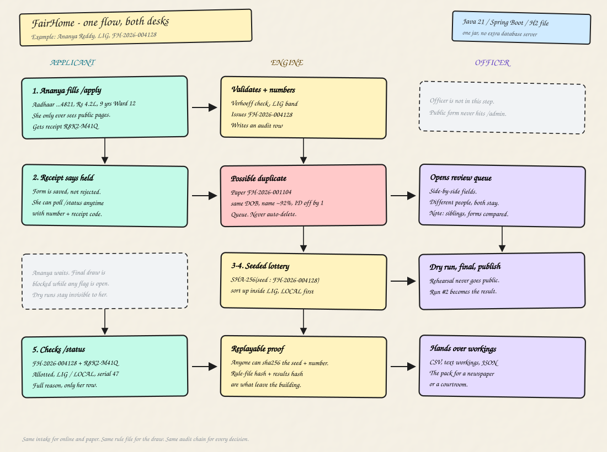

# FairHome Allocation

## 1. What this app does

FairHome Allocation is a single Java / Spring Boot service for a public housing draw.

It takes applications from two doors — the public form and an officer keying a paper form — through the **same** intake checks. It stops the same person appearing twice by parking lookalikes in a review queue instead of auto-rejecting them. It runs a **published, replayable** lottery (SHA-256 of a public seed plus the application number, not a hidden random generator). After an officer publishes a final draw, an applicant can look up **their** placement and the stored reason.

Nothing except **Java 21+** and a browser is required. The database is an H2 file created next to the process. There is no Node build and no separate database server.

| Who | What they use |
| --- | --- |
| Applicant | `/apply`, `/status`, `/rules`, `/verify`, `/results` |
| Officer | `/admin` — paper entry, duplicate queue, rule book, draw, audit |

## 2. How this works (HLD, Excalidraw-style)

One story, both desks. **Ananya Reddy** applies online. A paper form already on file looks like her. **Desk 1** decides they are two people, runs the draw, and publishes. Ananya then reads why she got a flat.



**The example, in words**

1. Ananya (34, LIG, ₹4.2 lakh, 9 years in Ward 12) submits `/apply`. The engine checks her Aadhaar-style ID (Verhoeff), puts her in LIG from income, and issues `FH-2026-004128` with receipt `R8K2-M41Q`.
2. Paper application `FH-2026-001104` already exists: same date of birth, name about 92% similar, national ID off by one digit. The engine **does not reject anyone**. Ananya is held as `PENDING_DUPLICATE_REVIEW` and a queue card is written.
3. The officer opens `/admin/duplicates`, compares the two cards, and chooses **Different people — both stay**. Both return to `SUBMITTED`. The note and the actor go on the audit trail. A final draw is refused while any flag is still open.
4. The officer rehearses a dry run (never public), then runs a final draw and publishes it. Lottery order is ascending `SHA-256(seed + ":" + FH-2026-004128)` inside LIG. Existing-resident seats (LOCAL) are filled first because she has 9 years in the area.
5. Ananya enters her application number and receipt on `/status`. She sees **Allotted · LIG / LOCAL · serial 47** and the step-by-step reason. She cannot open a neighbour’s row. Anyone can still recompute her token from the published seed.

The live board of this same story is also at `/hld` once the app is running.

## 3. Assumptions (the ones that were not spelled out)

- **600 identical flats** in one phase. No floor, block, or size sub-allocation.
- **Income category is derived** from declared income at draw time. The applicant does not pick EWS / LIG / MIG / HIG.
- **Existing resident** means at least 3 continuous years in the published area (configurable). It is a reserved quota inside every income category, not a tie-break.
- **Reserved quotas are vertical.** A qualifying applicant gets first claim on reserved seats **and** still competes for open seats.
- **Largest-remainder** turns percentages of 600 into whole flats. Reserved seats inside a category are rounded **down**, so rounding cannot steal from the open pool.
- **Unfilled reserved seats spill to that category’s open pool.** Unfilled category seats are redistributed scheme-wide by lottery rank (both policies are in the rule file).
- **Waiting list** is 25% of each category’s seats, rounded up.
- **The earlier claim is kept** when an officer confirms a duplicate, unless they explicitly keep the later one.
- **Demo data** (about 4,000 applications) is generated through the real intake path on first start, so the duplicate queue is genuine detector output.
- **One shared officer login**, not a staff directory. No roles beyond “officer”, no password reset, no SSO.
- **One process.** Intake is serialised with a lock. More than one instance would need a database lock.
- **H2 file mode**, not in-memory. A draw that has to survive a crash and a later review cannot live only in RAM.

## 4. Left out, and why

- **Real IAM, OTP, UIDAI.** Enough to keep the public off the draw controls. A live office would put their own identity provider in front of `/admin` before it left a closed network.
- **Document upload / certificate checks.** Disability and ex-serviceman status are declared. Checking the paper is an officer’s job this system does not pretend to do.
- **A generic rule DSL.** A closed set of named predicates (`LOCAL_RESIDENT`, `DIFFERENTLY_ABLED`, `WOMAN`, `EX_SERVICEMAN`, …) is small enough to read in one sitting. A DSL would let an operator invent an unauditable test.
- **Payments, allotment letters, surrender workflow.** The waitlist exists so a later surrender has an order to follow. That workflow is a different product.
- **Horizontal reservation (SC/ST/OBC).** The slice is income categories plus reserved quotas including local residents. Adding caste reservation later is a rule-file plus predicate change, not a rewrite.
- **A real append-only store or HSM.** The audit log is hash-chained in the same database it protects. Quiet one-row edits become visible; someone who can rewrite the whole file can still rebuild the chain. The artefacts meant to leave the building are the results hash and the rule-file hash.
- **Clustering / Postgres.** The brief was “any machine, just Java”. Swapping H2 for Postgres is a datasource URL; it is not needed to demonstrate the allocation.

## 5. How to run this app

Needs **Java 21+**. The app listens on **http://localhost:8080**.

```bash
./mvnw clean install
java -jar target/fairhome.jar
```

Windows: `mvnw.cmd clean install`, then the same `java -jar`.

Open [http://localhost:8080](http://localhost:8080).

On first start the process:

- creates `./data/fairhome.mv.db`
- publishes the rule book in `src/main/resources/rules/default-ruleset.json`
- seeds about 4,000 demo applications, including deliberate duplicates

Empty start (no demo people):

```bash
java -Dfairhome.demo-data.enabled=false -jar target/fairhome.jar
```

Officer console: [http://localhost:8080/admin](http://localhost:8080/admin)

```
username: admin
password: FairHome@2026
```

Change `fairhome.admin.username` and `fairhome.admin.password` in `src/main/resources/application.properties` before this is reachable from anywhere but your own machine.

Useful paths: `/apply`, `/status`, `/rules`, `/hld` (the example board), `/admin`.

Tests (JSON cases under `src/test/resources/cases/`):

```bash
./mvnw test
```

## 6. About the developer

I am **Tejas**, a Java backend developer with about **4 years 6 months** at SunTec Business Solutions (banking and telecom). Day-to-day I work in **Java, Spring Boot, microservices, Kafka, PostgreSQL / Oracle, REST, Docker, Git, Jenkins**.

I like finding the root cause, not only the patch. I built FairHome as a single-jar allocation system to show that same habit on a problem that has to be explained after the result is published.
